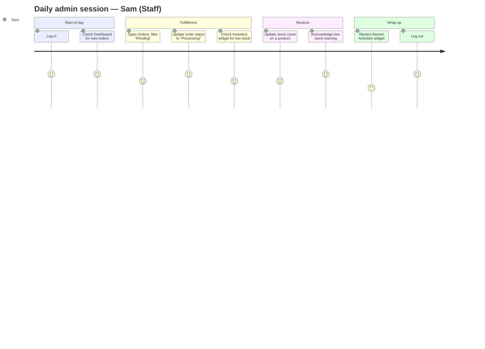
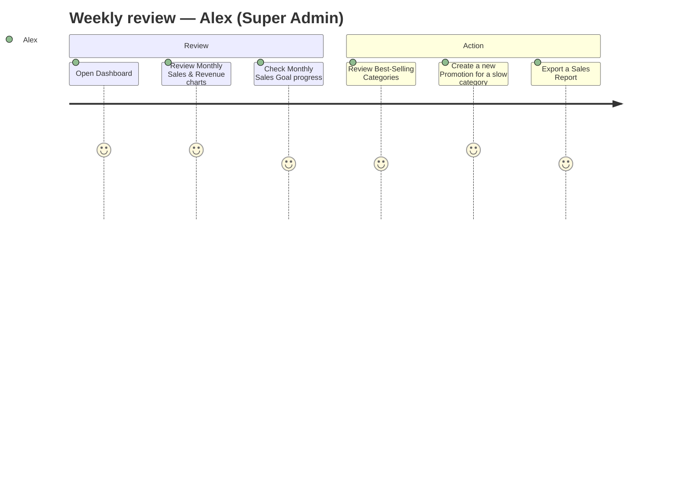
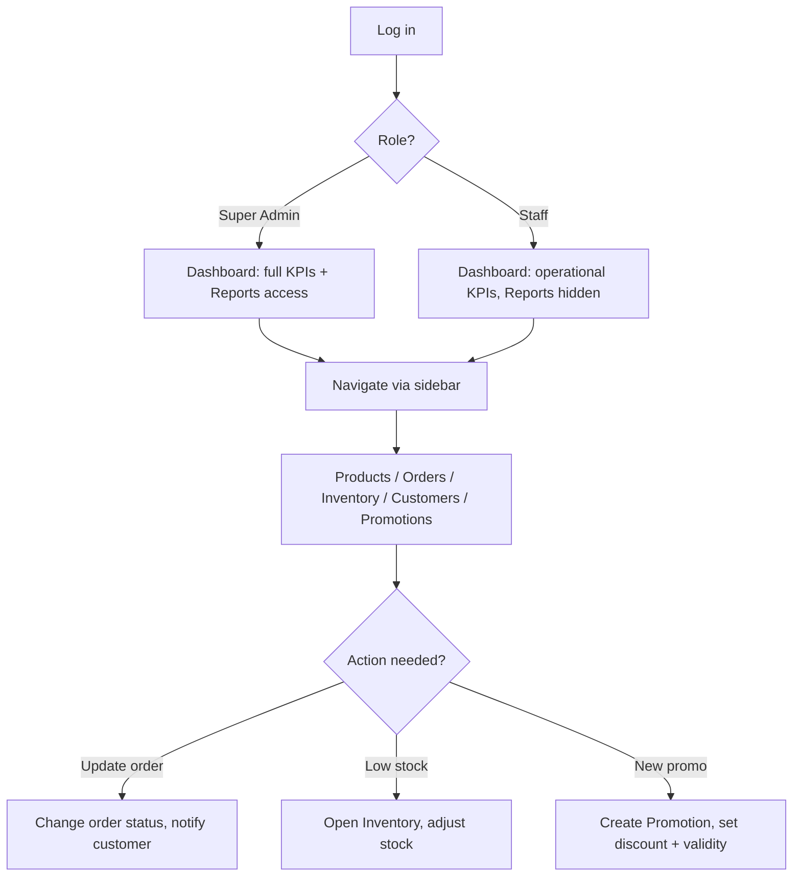
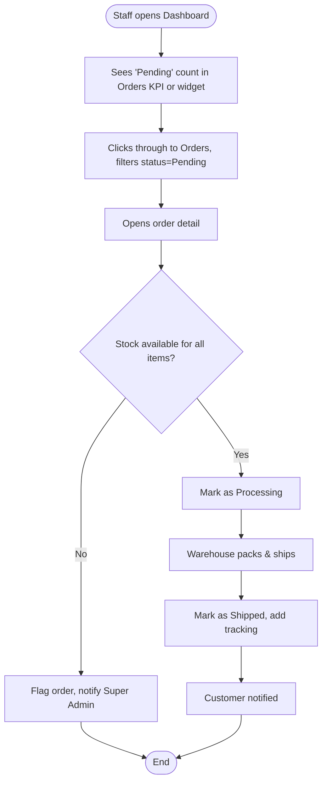
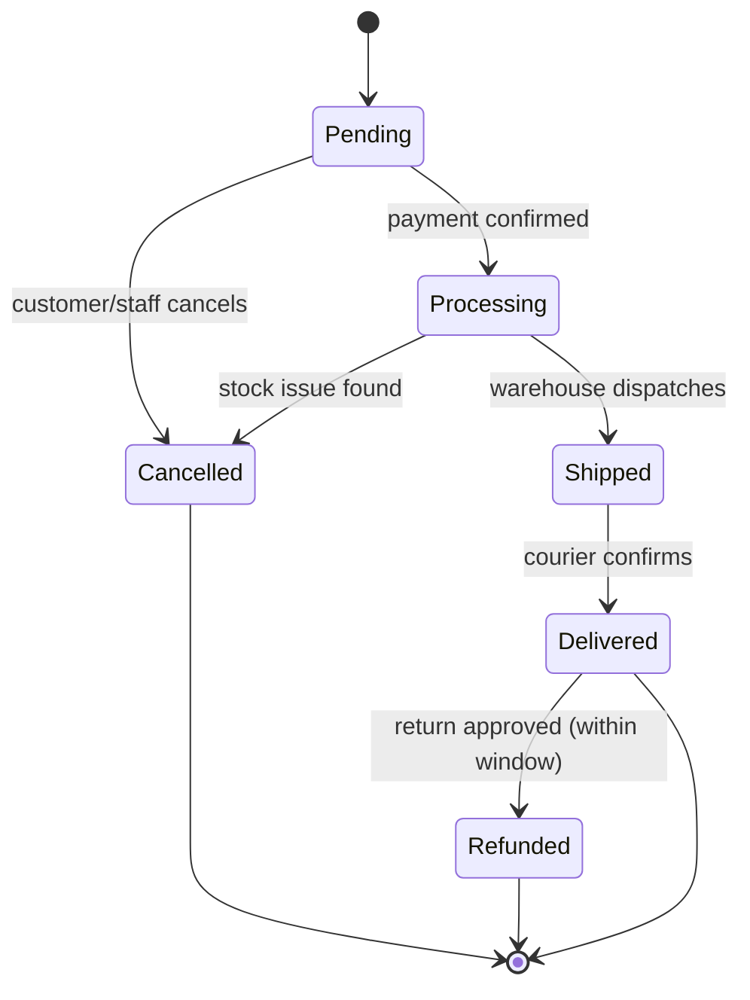
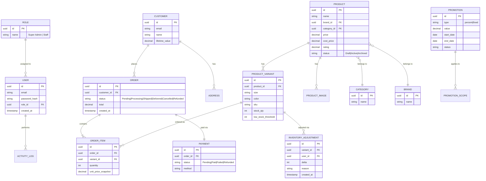
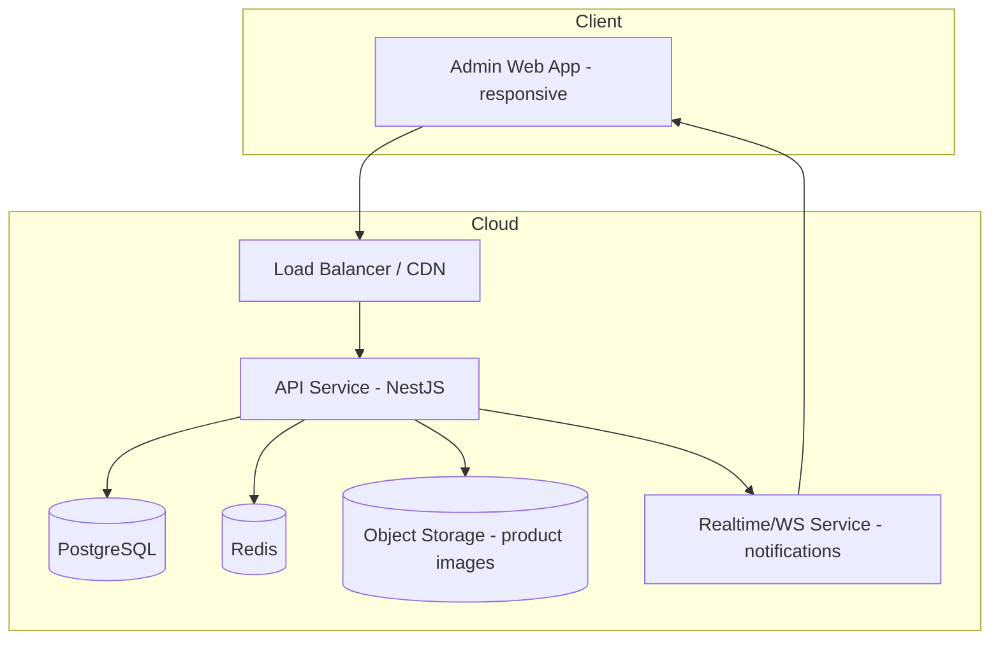

# Shoesmu Admin — Product Requirement Document

> Admin analytics & operations dashboard for the Shoesmu sneaker marketplace, built on the Shoesmu/Nike-derived design system (`DESIGN-nike.md`).

Status legend used throughout this document: **✔ Confirmed Requirement** (stated by stakeholder) · **⚠ Assumption** (reasonable default, listed in full in `## Assumptions`) · **❓ Open Question** (needs stakeholder input before/during build, listed in `## Open Questions`).

---

## Executive Summary

Shoesmu Admin is the internal operations console for the Shoesmu multi-brand sneaker marketplace (the storefront shown in the reference screenshot: Nike, Adidas, Puma, Vans, Reebok, Converse, New Balance). It gives the Shoesmu team a single place to read sales performance, manage the product catalog and stock, track and fulfill orders, understand customers, run promotions, and pull reports — replacing ad-hoc spreadsheets with a live, role-aware system of record.

The visual language is inherited directly from `DESIGN-nike.md`: flat surfaces, no drop shadows, `{colors.ink}` (#111111) as the only true black, pill-shaped primary actions, hairline dividers instead of elevation, and a restrained accent palette reserved for signal (sale red, success green, info blue) rather than decoration. Section `## Appendix → Design System Application Map` documents exactly how each dashboard component maps back to the source tokens.

## Problem Statement

Shoesmu's storefront (see reference screenshot) already serves customers across seven brands and multiple categories. The team currently lacks a unified backend view of that business: revenue and order volume are not visible in one place, stock levels are not proactively surfaced before a product goes out of stock, and there is no structured view of which customers or products actually drive revenue. Order status changes and promotions are managed manually, which does not scale past a handful of SKUs and is error-prone once staff other than the founder are involved.

## Business Goals

- ✔ Give the Shoesmu team real-time visibility into revenue, orders, and profit.
- ✔ Reduce stockouts by surfacing low-stock products before they hit zero.
- ⚠ Reduce the time staff spend manually updating order status and stock by centralizing these actions in one console.
- ⚠ Support delegating day-to-day operations (order fulfillment, stock updates) to staff without giving them access to financial reports or settings.

## Product Goals

- Single dashboard home screen surfacing the state of the business at a glance (KPIs + analytics + widgets), matching the brief's layout exactly.
- Full CRUD management for products, categories, promotions, and customers.
- Order tracking from placement through delivery/cancellation with clear status and payment visibility.
- Inventory visibility with proactive low-stock warnings.
- Role-aware access so Staff can operate day-to-day without touching Settings or sensitive reports.

## Success Metrics

| Metric | Target | ⚠/✔ |
|---|---|---|
| Time-to-detect a low-stock SKU (from stock dropping below threshold to admin visibility) | < 5 minutes (real-time widget) | ⚠ |
| Order status update time (order placed → status visible to admin) | Real-time (< 2s via API) | ⚠ |
| Dashboard initial load time | < 2s on broadband | ⚠ |
| Admin task completion: update stock for a product | ≤ 3 clicks from Dashboard | ⚠ |
| Reporting: monthly sales report export | ≤ 10s generation time | ⚠ |

## Stakeholders

| Role | Interest |
|---|---|
| Store Owner / Super Admin | Full visibility into revenue, profit, and control over settings, staff, and promotions |
| Operations Staff / Manager | Fulfills orders, manages stock and product listings day to day |
| Engineering team / AI coding agent | Implementation-ready spec: data model, API, permissions, UI spec |
| Customers (indirect) | Not users of this system, but the subject of the Customers and Orders modules |

## Scope

- ✔ Admin-facing web dashboard only (not the customer-facing storefront shown in the screenshot, which already exists as `Shoesmu.com`).
- Dashboard home (KPIs, 4 chart types, best-selling products, recent orders/inventory/activity widgets).
- Products, Categories, Orders, Customers, Inventory, Promotions, Reports, Settings modules (per sidebar nav in the brief).
- Global top navigation: search, notifications, messages, user profile/account menu.
- ⚠ Role-based access for two roles: Super Admin and Staff (see `## Assumptions`).
- ⚠ Full-stack implementation guidance (DB schema, API, auth) — this PRD assumes a real backend is being built, not a static mockup.

## Out of Scope

- The customer-facing storefront UI/UX (already live at Shoesmu.com per the reference screenshot) — this PRD only covers the internal admin console.
- Native mobile admin app (web-responsive only for v1; see Future Roadmap).
- Multi-warehouse / multi-store tenancy — v1 assumes a single Shoesmu store/warehouse context (see Open Questions).
- Marketplace seller onboarding (Shoesmu is modeled as a single-seller retailer reselling multiple brands, not a multi-vendor marketplace, for v1).
- Payment gateway reconciliation/settlement tooling beyond displaying payment status per order.

## Personas

**Alex — Store Owner (Super Admin)**
Runs Shoesmu day to day, cares about revenue trends, profit margin, and which brands/categories are actually selling. Needs the dashboard open in a tab most of the day and checks it on mobile between meetings. Full access to every module including Settings, Reports, and staff management.

**Sam — Operations Staff (Staff/Manager role)**
Handles order fulfillment, updates stock counts after physical inventory checks, and creates promotions during sales events. Does not need (and per ⚠ assumption, should not have) access to financial reports, revenue figures, or system settings.

## User Journey





## Information Architecture

```
Shoesmu Admin
├── Dashboard (home)
├── Products
│   ├── Product List
│   ├── Product Detail / Edit
│   └── Add Product
├── Categories
├── Orders
│   ├── Order List
│   └── Order Detail
├── Customers
│   ├── Customer List
│   └── Customer Profile
├── Inventory
│   ├── Stock Overview
│   └── Stock Adjustment Log
├── Promotions
│   ├── Promotion List
│   └── Create/Edit Promotion
├── Reports
│   ├── Sales Report
│   ├── Inventory Report
│   └── Customer Report
└── Settings
    ├── Store Profile
    ├── Staff & Roles ⚠ (Super Admin only)
    ├── Payment Methods
    └── Notifications Preferences
```

## Sitemap

| Route | Access | Notes |
|---|---|---|
| `/dashboard` | Super Admin, Staff | Home; KPIs + analytics + widgets |
| `/products` | Super Admin, Staff | List, filter, search |
| `/products/:id` | Super Admin, Staff | Edit product |
| `/products/new` | Super Admin, Staff | Create product |
| `/categories` | Super Admin, Staff | Category tree management |
| `/orders` | Super Admin, Staff | Order table |
| `/orders/:id` | Super Admin, Staff | Order detail + status update |
| `/customers` | Super Admin, Staff | Customer list |
| `/customers/:id` | Super Admin, Staff | Customer profile + order history |
| `/inventory` | Super Admin, Staff | Stock levels, adjustment log |
| `/promotions` | Super Admin, Staff | Promotion/coupon management |
| `/reports` | ⚠ Super Admin only | Financial reports |
| `/settings` | ⚠ Super Admin only (Staff & Roles, Payment); Staff can view Store Profile read-only | See Permission Matrix |
| `/login`, `/forgot-password` | Public (unauthenticated) | Auth |

## Navigation

**Sidebar (left, persistent, collapsible on tablet):** Dashboard, Products, Categories, Orders, Customers, Inventory, Promotions, Reports, Settings — icon + label, active item gets a solid `{colors.ink}` fill per the brand's admin-adapted nav treatment (see Appendix), rather than the storefront's underline treatment, since a vertical nav needs a fill/indicator rather than an underline.

**Top bar (persistent):** left-aligned breadcrumb/page title, center/right search pill (`{component.search-pill}`), notifications bell with unread-count badge, messages icon with unread-count badge, user profile avatar + dropdown (Profile, Settings, Log out).

## User Flow



## Task Flow — "Fulfill a pending order"



## Business Rules

- ✔ Products belong to exactly one primary Category and one Brand (Nike, Adidas, Puma, Vans, Reebok, Converse, New Balance, ⚠ extensible list).
- ⚠ A product has one or more Variants (size × color), each with its own stock count and optional price override; the KPI "Products Sold" and the Inventory widget operate at the variant level, rolled up to the product level for display.
- ⚠ Low-stock threshold defaults to 10 units per variant and is configurable per product in Settings/Product edit; falling at or below this threshold triggers a "Low Stock" warning badge and an entry in the Inventory widget.
- ⚠ Out-of-stock (0 units) removes the "Add to bag" affordance on the live storefront (downstream system, referenced for context only) and shows a red "Out of Stock" badge in the admin.
- ✔ Orders move through a fixed status lifecycle: `Pending → Processing → Shipped → Delivered`, with `Cancelled` and `Refunded` as terminal side-branches reachable from `Pending` or `Processing` only (see State Diagram).
- ⚠ Orders cannot be edited (line items/prices) once in `Processing` or later — only cancelled/refunded as a whole.
- ⚠ Monthly Profit KPI = Total Revenue − COGS (cost of goods sold, at product cost field) − ⚠ refunds for that month; exact formula is an ❓ Open Question pending finance input.
- ⚠ Promotions cannot have a discount percentage greater than 90% or a date range where `end_date < start_date`.
- ⚠ A Staff-role user cannot view `Reports`, cannot manage `Staff & Roles` or `Payment Methods` in Settings, and cannot see profit-margin figures on product detail (cost price is hidden for Staff).

## Functional Requirements

### Feature: Dashboard Overview

**Description:** The system's home screen: five KPI cards, four analytics charts, a best-selling products table, and four supporting widgets (Most Viewed Products, Daily Revenue, Monthly Sales Goal, Recent Activities), per the brief's layout.

**Objective:** Give any admin user a complete read on business health within one screen-load, with role-appropriate detail.

**User Story:** As a Super Admin, I want to see revenue, orders, customers, products sold, and profit at a glance, so that I can spot trends without digging through separate reports.

**Acceptance Criteria:**
- Given a Super Admin logs in, when the Dashboard loads, then all 5 KPI cards (Total Revenue, Total Orders, Customers, Products Sold, Monthly Profit) render with the current month's figures and a period-over-period delta indicator (e.g. "+12% vs last month").
- Given a Staff user logs in, when the Dashboard loads, then the Monthly Profit KPI and Weekly Revenue figures are replaced with a "Restricted" state (per Permission Matrix), while operational KPIs (Orders, Products Sold) remain visible.
- Given the Monthly Sales line chart, when the user hovers a data point, then a tooltip shows exact revenue and order count for that month.
- Given the Best-Selling Categories bar chart, when categories tie in sales, then they are ordered alphabetically as a tiebreaker.
- Given the Inventory widget shows a product at or below its low-stock threshold, when the admin clicks it, then they are routed to that product's detail view in Inventory.
- Given no data exists yet (new store state), when the Dashboard loads, then each chart/widget shows an explicit empty state ("No sales yet this month") rather than a blank chart.

**Validation Rules:** Date-range filters (if added, see Future Enhancement) must not allow `to` date before `from` date.

**Edge Cases:** Zero orders in the selected period; a product appearing in both Best-Selling and Low-Stock simultaneously; KPI delta calculation when the prior period has zero orders (show "New" instead of a divide-by-zero percentage).

**Error Handling:** If the analytics API times out, each widget shows its own inline retry state rather than failing the whole page.

**Business Rules:** KPI periods default to "This Month" (calendar month to date); ⚠ configurable to "Last 7 Days" / "Last 30 Days" / "Custom" as a Should-have.

**Dependencies:** Orders, Products, Customers, Inventory modules (Dashboard reads from all of them; it owns no data itself).

**Priority:** Must-have.

**Future Enhancement:** Custom date-range picker; per-brand KPI breakdown; export dashboard as PDF snapshot.

---

### Feature: Products Management

**Description:** CRUD for the product catalog: name, brand, category, price, images, variants (size/color/stock), rating, and status.

**Objective:** Keep the catalog accurate so the storefront and the admin's own KPIs/reports reflect reality.

**User Story:** As a Staff member, I want to add a new shoe listing with sizes and stock, so that it becomes sellable on the storefront.

**Acceptance Criteria:**
- Given a user with product-write permission, when they submit the "Add Product" form with all required fields, then a new product is created in `Draft` status until at least one variant has stock > 0, then auto-flips to `Active`.
- Given a product has zero variants with stock, when viewed in the Products list, then it shows an "Out of Stock" badge.
- Given a Staff user opens a product detail, when the cost price field is rendered, then it is hidden/masked (Super Admin only, per Business Rules).
- Given a duplicate SKU is submitted for a variant, when the form is saved, then it is rejected with a field-level validation error.

**Validation Rules:** `name` required, 3–120 chars; `price` > 0; `SKU` unique per variant across the whole catalog; at least one product image required before status can be `Active`.

**Edge Cases:** Product with a single variant (no size/color options); bulk price update across many products (Should-have); image upload failure mid-save (partial save should not corrupt the product record).

**Error Handling:** Image upload failures show a retry affordance per-image, not a full-form failure; SKU conflicts return a 409 with the conflicting SKU named.

**Business Rules:** A product cannot be deleted if it has ever appeared in a completed order — it must be archived (soft-delete / `status = archived`) instead, to preserve order history integrity.

**Dependencies:** Categories (product must reference an existing category), Inventory (variant stock is the source of truth for stock widgets).

**Priority:** Must-have.

**Future Enhancement:** Bulk CSV import/export; AI-generated product descriptions; variant-level images.

---

### Feature: Categories Management

**Description:** Manage the category taxonomy (e.g. Sneakers, Flats, Sandals, Heels, per the reference screenshot's filter panel) used for storefront filtering and the Best-Selling Categories chart.

**Objective:** Keep taxonomy consistent so analytics and storefront filters stay meaningful.

**User Story:** As a Super Admin, I want to add or rename a category, so that new product types can be organized correctly.

**Acceptance Criteria:**
- Given a category has products assigned, when a Super Admin attempts to delete it, then the system blocks deletion and prompts to reassign products first.
- Given a new category is created, when saved, then it immediately appears as a filter option and in category-based analytics going forward (historical data is not retroactively recategorized).

**Validation Rules:** Category name unique (case-insensitive), 2–50 chars.

**Edge Cases:** Renaming a category referenced in an active promotion; nested subcategories (⚠ v1 assumes a flat, single-level category list, matching the reference screenshot's flat sidebar filter — see Open Questions for whether nesting is needed).

**Error Handling:** Attempted deletion of a category in use returns a clear count ("12 products use this category") rather than a generic error.

**Business Rules:** Categories cannot be deleted, only archived, if referenced by historical orders (for reporting integrity).

**Dependencies:** Products.

**Priority:** Must-have.

**Future Enhancement:** Nested/hierarchical categories; category-level imagery for storefront merchandising.

---

### Feature: Orders Management & Tracking

**Description:** Table of all orders (Order ID, Customer, Product, Status, Payment, Date) with detail view and status-update actions, per the brief.

**Objective:** Give staff a single place to track and progress every order from placement to delivery.

**User Story:** As a Staff member, I want to filter orders by status and update them as I fulfill them, so that customers get accurate tracking information.

**Acceptance Criteria:**
- Given the Orders table, when filtered by status = "Pending", then only pending orders display, sorted newest-first by default.
- Given an order's payment status is "Failed", when viewed in the table, then it is visually distinguished from "Paid" (per Appendix badge tokens) and cannot be progressed past `Pending` until payment succeeds or is marked as paid manually (⚠ for offline/COD payments).
- Given a Staff user updates an order to "Shipped", when saved, then a tracking-number field becomes required and a customer notification is queued (see Notifications feature).
- Given an order is "Delivered", when viewed, then no further status transitions are available except "Refunded" within a configurable return window (⚠ 14 days default).

**Validation Rules:** Status transitions are only allowed along the paths defined in the State Diagram below; out-of-sequence transitions (e.g. `Pending → Delivered`) are rejected server-side even if attempted via direct API call.

**Edge Cases:** Order containing a since-archived product (must still display historical product name/image/price as a snapshot, not a live reference); partial refunds (Should-have, v1 supports full-order refund only); concurrent staff members updating the same order (last-write-wins with an updated_at conflict warning).

**Error Handling:** Failed status update shows the specific reason (e.g. "Cannot ship: payment not confirmed").

**Business Rules:** Orders cannot be edited (line items/prices) once `Processing` or later, per global Business Rules.

**Dependencies:** Customers, Products (snapshotted at order time), Inventory (stock is decremented on order placement, restored on cancellation).

**Priority:** Must-have.

**Future Enhancement:** Bulk status updates; printable packing slips; carrier API integration for live tracking.



---

### Feature: Customers Management

**Description:** List and profile view of registered customers: contact info, order history, lifetime value, and status.

**Objective:** Understand who the highest-value customers are and support them directly when needed.

**User Story:** As a Super Admin, I want to see a customer's full order history and lifetime spend, so that I can identify VIP customers for targeted promotions.

**Acceptance Criteria:**
- Given a customer profile, when opened, then it shows lifetime order count, lifetime spend, and a chronological order list linking to each order detail.
- Given the Customers list, when sorted by "Lifetime Value", then customers rank highest-spend-first.
- Given a customer has never completed an order (browsed only), when viewed, then lifetime spend shows $0 and order list is empty, not an error state.

**Validation Rules:** Customer email must be unique; customers are created by the storefront's own signup flow (⚠ this admin module is read/manage only, not customer creation, per Out of Scope boundary with the live storefront).

**Edge Cases:** Guest checkout orders (no registered account) — ⚠ assumed shown as an "Order" without a linked Customer profile, listed under a "Guest" pseudo-entry in Reports.

**Error Handling:** N/A beyond standard list/detail load failures.

**Business Rules:** Staff can view customer contact info and order history but ⚠ cannot see full payment details (last-4 card digits only, never full card numbers — full PAN is never stored per PCI scope, see Security).

**Dependencies:** Orders.

**Priority:** Must-have.

**Future Enhancement:** Customer segmentation/tagging; CRM-style notes on a customer profile; email/SMS campaign trigger from a customer segment.

---

### Feature: Inventory Management

**Description:** Stock overview across all product variants with progress-bar stock levels, low-stock warning badges, and a manual stock-adjustment log, per the brief's Inventory widget.

**Objective:** Prevent stockouts and give a clear, auditable record of manual stock corrections (e.g. after a physical count).

**User Story:** As a Staff member, I want to see which products are running low on stock, so that I can reorder or flag them before they sell out.

**Acceptance Criteria:**
- Given a variant's stock is at or below its low-stock threshold, when the Inventory widget renders, then it appears in the "Low Stock" list with a warning badge and a stock progress bar reflecting `current / restock_target`.
- Given a Staff member manually adjusts stock (e.g. +20 units after a delivery), when saved, then an entry is written to the Stock Adjustment Log with user, timestamp, delta, and optional reason.
- Given a variant hits 0 stock, when the Inventory widget renders, then it moves from "Low Stock" (yellow) to "Out of Stock" (red) badge state.

**Validation Rules:** Manual stock adjustment cannot result in a negative stock value; adjustment reason is required when the delta is negative (shrinkage/damage) — optional when positive (restock).

**Edge Cases:** Two staff adjusting the same variant's stock near-simultaneously (last-write-wins with a visible "stock changed since you loaded this page" warning); a stock adjustment that crosses back above the low-stock threshold should immediately clear the warning badge.

**Error Handling:** Adjustment rejected with a specific message if it would go negative ("Cannot reduce stock below 0; current stock is 3").

**Business Rules:** Order placement automatically decrements stock (system-generated log entries, distinct from manual adjustments); order cancellation restores it.

**Dependencies:** Products (variant-level stock lives on the Product Variant entity), Orders (auto-decrement/restore).

**Priority:** Must-have.

**Future Enhancement:** Low-stock email/Slack alerts; automatic purchase-order suggestions; multi-warehouse stock allocation.

---

### Feature: Promotions Management

**Description:** Create and manage discounts/coupons — percentage or fixed-amount off, scoped to a product, category, brand, or store-wide, with a validity window.

**Objective:** Let the team run sales events (e.g. the "Sale" tab visible on the storefront nav) without engineering involvement.

**User Story:** As a Super Admin, I want to create a 20%-off promotion for the "Sandals" category for one week, so that I can move slow-selling stock.

**Acceptance Criteria:**
- Given a promotion is created with `start_date` in the future, when saved, then it shows status "Scheduled" until `start_date` arrives, then auto-flips to "Active".
- Given a promotion's `end_date` passes, when the next scheduled job runs, then it auto-flips to "Expired" and stops applying on the storefront.
- Given two promotions overlap on the same product, when both are active, then ⚠ the storefront applies whichever yields the larger discount to the customer (stacking is not supported in v1).

**Validation Rules:** `discount_percent` between 1–90; `end_date` ≥ `start_date`; scope (product/category/brand/store-wide) is required.

**Edge Cases:** Promotion targeting a category that gets deleted mid-run (promotion should auto-expire, not error); promotion on a product that goes out of stock (promotion stays valid, simply inapplicable until restocked).

**Error Handling:** Invalid discount/date combinations are rejected inline at the form level before submission.

**Business Rules:** Promotions cannot be edited once `Active` except to shorten the `end_date` (early termination) — changing the discount value mid-run requires ending the current promotion and creating a new one, to keep historical order records accurate for reporting.

**Dependencies:** Products, Categories.

**Priority:** Should-have (v1 can ship with basic store-wide/category promos; product-level stacking rules are Should-have refinement).

**Future Enhancement:** Coupon codes for customer self-entry at checkout; tiered/bundle promotions (buy-2-get-10%-off).

---

### Feature: Reports

**Description:** Sales, inventory, and customer reports with export (CSV/PDF), scoped to a date range.

**Objective:** Give the Super Admin the numbers needed for finance/accounting without manual spreadsheet building.

**User Story:** As a Super Admin, I want to export a monthly sales report, so that I can reconcile revenue with accounting.

**Acceptance Criteria:**
- Given a Super Admin selects a date range and clicks "Export Sales Report", then a CSV/PDF is generated containing order-level revenue, refunds, and net revenue for that range.
- Given a Staff user attempts to access `/reports`, when the route loads, then they see a "Restricted — Super Admin only" state, not the report content (per Permission Matrix).

**Validation Rules:** Date range required; `to` ≥ `from`; max range ⚠ 366 days per export to bound report-generation time.

**Edge Cases:** Report requested for a period with zero orders (should still generate a valid, empty report, not error).

**Error Handling:** If export generation exceeds a timeout, the user gets an async "we'll email you the file" fallback (⚠ Should-have; v1 can be synchronous for ranges ≤ 90 days).

**Business Rules:** Cost/profit figures in reports are Super-Admin-only, consistent with the Dashboard and Product-detail masking rules.

**Dependencies:** Orders, Products, Customers, Inventory (source data for all report types).

**Priority:** Must-have (Sales Report); Should-have (Inventory & Customer Reports).

**Future Enhancement:** Scheduled recurring report emails; custom report builder.

---

### Feature: Settings

**Description:** Store profile (name, logo, contact info), staff & role management, payment method configuration, and notification preferences.

**Objective:** Central place to configure the store and control who has access to what.

**User Story:** As a Super Admin, I want to invite a new staff member and assign them the Staff role, so that they can start fulfilling orders without seeing financial reports.

**Acceptance Criteria:**
- Given a Super Admin adds a new staff account with role = Staff, when the invite is accepted, then that user's session is restricted per the Permission Matrix from first login.
- Given a Staff user opens Settings, when the page loads, then only "Store Profile" is visible in read-only mode; "Staff & Roles" and "Payment Methods" are hidden entirely (not just disabled) per the Permission Matrix.
- Given the last remaining Super Admin account, when someone attempts to delete or demote it, then the system blocks the action to prevent a store with zero admins.

**Validation Rules:** At least one Super Admin must always exist; staff invite email must be a valid, unique address.

**Edge Cases:** Staff member removed while they have an active session (⚠ session should be invalidated within one token-refresh cycle, ≤ 15 min).

**Error Handling:** Attempt to demote the last Super Admin returns a clear blocking message, not a silent failure.

**Business Rules:** Only a Super Admin can create/edit/remove other admin accounts or change roles.

**Dependencies:** Auth/RBAC system.

**Priority:** Must-have (Store Profile, Staff & Roles); Should-have (Payment Methods config — ⚠ assumes payment gateway is pre-integrated and this screen only toggles which methods are shown at checkout).

**Future Enhancement:** Granular custom permission sets beyond the two default roles; audit log export from Settings.

---

### Feature: Notifications & Messages (Top Nav)

**Description:** Bell icon surfaces system notifications (new order, low stock, refund request); messages icon surfaces customer-support style threads (⚠ scope assumed to be internal system alerts + a lightweight customer-inquiry inbox, not a full live-chat product).

**Objective:** Make sure time-sensitive events (new order, stock hitting zero) are never missed just because a user isn't on the Dashboard.

**User Story:** As a Staff member, I want a badge on the bell icon when a new order comes in, so that I don't have to keep refreshing the Orders page.

**Acceptance Criteria:**
- Given a new order is placed, when it completes payment, then a notification is created and the bell badge count increments in real time (⚠ via WebSocket/SSE) for all users with order-view permission.
- Given a user opens the notifications panel, when they click a notification, then they are routed to the relevant detail (e.g. the order in question) and the notification is marked read.

**Validation Rules:** N/A (system-generated, not user input).

**Edge Cases:** Notification for an entity later deleted/archived (e.g. a cancelled order) should still be clickable and show an "Order was cancelled" context banner rather than a dead link.

**Error Handling:** If the real-time channel disconnects, notifications fall back to polling every 30s rather than silently going stale.

**Business Rules:** Low-stock and financial notifications respect the same role visibility as their source module (Staff does not get profit-related alerts).

**Dependencies:** Orders, Inventory.

**Priority:** Should-have for v1 (badge + list); Nice-to-have: full threaded customer messaging inbox.

**Future Enhancement:** Push notifications (browser/mobile); notification preference granularity per event type.

---

### Feature: Authentication & Role-Based Access Control

**Description:** Login, session management, and the two-role permission system (Super Admin, Staff) that gates every module above.

**Objective:** Ensure only authorized staff can access the console, and that access is scoped appropriately per role.

**User Story:** As a Super Admin, I want to log in securely and know that Staff accounts can't see profit or settings data, so that sensitive business data stays protected.

**Acceptance Criteria:**
- Given valid credentials, when a user logs in, then they receive a session (JWT access + refresh token pair) scoped to their role.
- Given an expired or invalid token, when any protected route is requested, then the API returns 401 and the frontend redirects to `/login`.
- Given a Staff-role token, when it's used to call a Super-Admin-only endpoint directly (e.g. `/reports/export`), then the API returns 403, independent of what the frontend UI shows (server-side enforcement, not just UI hiding).

**Validation Rules:** Password minimum 10 characters, 1 number, 1 symbol (⚠ default policy); account lockout after 5 failed attempts within 15 minutes.

**Edge Cases:** Password reset for an account whose email was later changed; simultaneous login from two devices (⚠ allowed by default, no single-session enforcement in v1).

**Error Handling:** Generic "invalid email or password" message on failed login (never reveal which field was wrong, to avoid user enumeration).

**Business Rules:** All authorization checks happen server-side; the frontend hiding a nav item is a UX convenience only, never the actual security boundary.

**Dependencies:** None (foundational — every other feature depends on this).

**Priority:** Must-have.

**Future Enhancement:** SSO (Google Workspace) for staff login; 2FA/MFA; granular custom roles beyond the two defaults.

## Non-Functional Requirements

| Category | Requirement |
|---|---|
| Performance | Dashboard initial load ⚠ < 2s on broadband; API p95 response time ⚠ < 300ms for list endpoints |
| Availability | ⚠ 99.5% uptime target for v1 (single-region deployment, not yet multi-region HA) |
| Scalability | ⚠ Designed to comfortably handle up to ~50k SKUs / ~100k orders/year without architecture change; beyond that, read-replica and caching strategy should be revisited |
| Accessibility | WCAG AA minimum on all admin screens (tables, forms, charts must have text-equivalent data, not color-only status indicators) |
| Browser support | ⚠ Latest 2 versions of Chrome, Safari, Edge, Firefox; responsive down to tablet width (1024px); mobile phone width is "usable" but not the primary design target for an admin console |
| Data retention | ⚠ Order and customer data retained indefinitely unless a deletion request is received (see Security/GDPR-style note) |
| Localization | ⚠ v1 ships English + Indonesian UI strings, single currency display (USD, matching the reference screenshot's `$` pricing) — see Open Questions on whether IDR is actually needed |

## Database Recommendation

⚠ PostgreSQL as the primary relational store (strong fit for the relational order/product/inventory model and reporting joins), with Redis for session/token caching and real-time notification pub/sub, and S3-compatible object storage for product images.

## Entity List

`User (admin/staff)`, `Role`, `Customer`, `Address`, `Brand`, `Category`, `Product`, `ProductVariant`, `ProductImage`, `Order`, `OrderItem`, `Payment`, `Promotion`, `PromotionScope`, `InventoryAdjustment`, `Notification`, `ActivityLog`.

## ERD Recommendation



## API Recommendation

⚠ REST over HTTPS, JSON payloads, versioned at `/api/v1`. Representative endpoints (not exhaustive — full contract lives in the AI Coding Context prompt pack in the Appendix):

```
POST   /api/v1/auth/login
POST   /api/v1/auth/refresh
GET    /api/v1/dashboard/kpis?period=this_month
GET    /api/v1/dashboard/charts/monthly-sales
GET    /api/v1/dashboard/charts/category-sales
GET    /api/v1/dashboard/charts/sales-distribution
GET    /api/v1/dashboard/charts/weekly-revenue
GET    /api/v1/products?category=&brand=&status=&page=
POST   /api/v1/products
GET    /api/v1/products/:id
PATCH  /api/v1/products/:id
DELETE /api/v1/products/:id            # soft-delete/archive only
GET    /api/v1/categories
POST   /api/v1/categories
GET    /api/v1/orders?status=&page=
GET    /api/v1/orders/:id
PATCH  /api/v1/orders/:id/status
GET    /api/v1/customers?sort=lifetime_value
GET    /api/v1/customers/:id
GET    /api/v1/inventory/low-stock
POST   /api/v1/inventory/:variantId/adjust
GET    /api/v1/promotions
POST   /api/v1/promotions
GET    /api/v1/reports/sales?from=&to=
GET    /api/v1/settings/staff
POST   /api/v1/settings/staff/invite
```

## Authentication

⚠ JWT (short-lived access token ~15 min + rotating refresh token ~7 days), httpOnly secure cookie storage for refresh token to mitigate XSS token theft. Login rate-limited per IP and per account.

## Authorization

⚠ RBAC with two roles for v1 (`super_admin`, `staff`), enforced at the API layer via middleware/guards on every route — never solely in the frontend. See Permission Matrix.

## Permission Matrix

| Feature / Action | Staff | Super Admin |
|---|:---:|:---:|
| View Dashboard (operational KPIs: Orders, Products Sold) | ✔ | ✔ |
| View Dashboard financial KPIs (Revenue, Profit) | | ✔ |
| Manage Products (create/edit) | ✔ | ✔ |
| Delete/Archive Products | | ✔ |
| View Product cost price | | ✔ |
| Manage Categories | ✔ | ✔ |
| View & update Orders | ✔ | ✔ |
| Cancel/Refund Orders | | ✔ |
| View Customers | ✔ | ✔ |
| Adjust Inventory stock | ✔ | ✔ |
| Manage Promotions | ✔ | ✔ |
| View Reports | | ✔ |
| Manage Settings → Store Profile (view) | ✔ | ✔ |
| Manage Settings → Store Profile (edit) | | ✔ |
| Manage Settings → Staff & Roles | | ✔ |
| Manage Settings → Payment Methods | | ✔ |

## Security

- ⚠ All traffic over HTTPS/TLS 1.2+.
- ⚠ Passwords hashed with bcrypt/argon2, never stored/logged in plaintext.
- ⚠ Full card PANs are never stored server-side (delegate to a PCI-compliant payment processor; only last-4 + brand stored for display, matching the Customers-feature business rule).
- ⚠ All destructive/role-sensitive actions (staff invite, role change, product archive, refund) write to `ActivityLog` for audit purposes.
- ⚠ Rate limiting and brute-force lockout on `/auth/login`.
- ❓ Data residency / privacy regulation scope (GDPR-equivalent, or Indonesia's PDP Law) is unconfirmed — affects retention and deletion-request handling; flagged in Open Questions.

## Performance

Target p95 API latency < 300ms for list/detail endpoints; dashboard KPI/chart endpoints should be backed by pre-aggregated/materialized data (refreshed ⚠ every 5 minutes or on order-state-change) rather than computed live on every page load, to keep Dashboard load under the 2s target as order volume grows.

## Scalability

⚠ Stateless API layer behind a load balancer so it can scale horizontally; PostgreSQL read replica introduced once reporting queries start contending with transactional traffic; Redis cache for dashboard aggregates and session data.

## Logging & Monitoring

⚠ Centralized structured logging (e.g. JSON logs to a log aggregator), application error tracking (e.g. Sentry-equivalent), uptime/health-check monitoring on the API and database, and the in-app `ActivityLog` entity for business-level audit trail (distinct from infra logs).

## Analytics

Dashboard charts and Reports module constitute the product's own analytics surface (see Functional Requirements → Dashboard Overview and Reports). ⚠ Product usage analytics (which admin features staff actually use) is a Nice-to-have for a future internal-tooling iteration, not part of v1 scope.

## Notifications

See `Feature: Notifications & Messages` above for in-app scope. ⚠ Email notifications (e.g. daily digest of new orders, low-stock alerts) are a Should-have for v1; SMS/push are Future Roadmap.

## Deployment



## Tech Stack Recommendation

⚠ Default modern baseline (swap freely if the team has an existing stack):

- **Frontend:** Next.js + TypeScript + Tailwind CSS + shadcn/ui, charting via Recharts, following the token mapping in the Appendix.
- **Backend:** NestJS + Prisma ORM.
- **Database:** PostgreSQL (primary) + Redis (cache/session/pub-sub for real-time notifications).
- **Storage:** S3-compatible object storage for product images.
- **Auth:** JWT + RBAC (two roles for v1).
- **Infra:** Docker containers, GitHub Actions CI/CD, deployable to any major cloud (AWS/GCP/Azure) or a PaaS (Render/Railway) for faster v1 shipping.

## Frontend Architecture

⚠ Component-driven Next.js app: a shared `AdminLayout` (sidebar + top nav) wrapping all authenticated routes; feature folders (`products/`, `orders/`, `inventory/`, etc.) each owning their own components, hooks, and API client calls; shared `design-system/` folder implementing the tokens in the Appendix as Tailwind theme extensions + a small component library (KpiCard, DataTable, StatusBadge, ChartCard) so every module composes from the same primitives instead of re-implementing card/table chrome.

## Backend Architecture

⚠ Modular NestJS structure: one module per bounded context (`auth`, `products`, `categories`, `orders`, `customers`, `inventory`, `promotions`, `reports`, `dashboard`, `notifications`), each with its own controller/service/repository layers over Prisma, plus a shared `common` module for guards (RBAC), interceptors (logging, response shaping), and the `ActivityLog` writer.

## Infrastructure

⚠ Containerized services behind a load balancer; managed PostgreSQL (e.g. RDS/Cloud SQL equivalent) with daily automated backups; managed Redis; CDN in front of the object storage bucket for product images; environment-based config (`.env` per stage: dev/staging/prod).

## Folder Structure

```
shoesmu-admin/
├── apps/
│   ├── web/                  # Next.js admin frontend
│   │   ├── app/
│   │   │   ├── (auth)/login/
│   │   │   └── (dashboard)/
│   │   │       ├── dashboard/
│   │   │       ├── products/
│   │   │       ├── categories/
│   │   │       ├── orders/
│   │   │       ├── customers/
│   │   │       ├── inventory/
│   │   │       ├── promotions/
│   │   │       ├── reports/
│   │   │       └── settings/
│   │   ├── components/
│   │   │   ├── design-system/   # KpiCard, StatusBadge, DataTable, ChartCard, Sidebar, TopNav
│   │   │   └── charts/
│   │   └── lib/api/
│   └── api/                  # NestJS backend
│       └── src/
│           ├── auth/
│           ├── products/
│           ├── categories/
│           ├── orders/
│           ├── customers/
│           ├── inventory/
│           ├── promotions/
│           ├── reports/
│           ├── dashboard/
│           ├── notifications/
│           └── common/ (guards, interceptors, activity-log)
├── packages/
│   └── shared-types/         # DTOs shared between web and api
└── prisma/
    └── schema.prisma
```

## Coding Conventions

⚠ TypeScript strict mode across frontend and backend; ESLint + Prettier enforced in CI; DTOs validated with `class-validator` on the API boundary; React components function-based with hooks; API responses follow a consistent envelope (`{ data, meta, error }`); commit convention: Conventional Commits (`feat:`, `fix:`, `chore:`).

## Testing Strategy

| Layer | Approach |
|---|---|
| Unit | Business logic (order status transitions, promotion validation, low-stock calculation) covered with unit tests per module |
| Integration | API endpoint tests against a test database for each module's CRUD + permission boundaries |
| E2E | Critical admin flows: login → view dashboard, create product, update order status, adjust stock, create promotion |
| Regression checklist | Re-verify Permission Matrix on every release (Staff cannot reach Reports/Settings-restricted actions even via direct API call) |
| Performance | Load test dashboard endpoints at ⚠ expected peak (e.g. 50 concurrent admin sessions) before go-live |

## Acceptance Criteria (Global)

- Given any Staff-role session, when they attempt any Super-Admin-only action via direct API call (not just UI), then the API returns 403 — the Permission Matrix is enforced server-side, not just hidden in the UI.
- Given the Dashboard is loaded by any authenticated user, when the page finishes loading, then every KPI card, chart, and widget shows either real data or an explicit empty/error state — never an indefinite spinner.
- Given an order's status changes, when the change is saved, then the Inventory stock for its line items updates consistently within the same transaction (no partial/inconsistent state).
- Given the design system in `DESIGN-nike.md`, when any new admin screen is built, then it uses only the token vocabulary in the Appendix's Application Map (no ad-hoc colors, shadows, or button shapes).

## Risk Analysis

| Risk | Impact | Mitigation |
|---|---|---|
| Nike's flat, no-shadow storefront system doesn't obviously translate to a data-dense admin UI | Medium | Appendix defines explicit adaptations (hairline-bordered cards instead of shadow-elevated cards, filled active-state sidebar instead of underline nav) so density doesn't get lost |
| Two-role RBAC turns out to be insufficient once the team grows | Medium | Data model supports adding roles/granular permissions later without a schema rewrite (Role is already a separate entity, not a hardcoded enum on User) |
| Profit/COGS formula disputed by finance later | Medium | Flagged as ❓ Open Question now rather than silently baked into reports |
| Real-time notification infra (WebSocket/SSE) adds early complexity | Low-Medium | Polling fallback defined; real-time can be deferred to a fast-follow if timeline is tight |
| Single-warehouse assumption doesn't hold if Shoesmu expands | Medium | Flagged as Open Question; Inventory/Variant model can extend with a `warehouse_id` later without breaking v1 |

## Future Roadmap

- Native mobile companion app for order/stock alerts on the go.
- Multi-warehouse inventory allocation.
- Coupon codes and stacked/tiered promotions.
- Scheduled/emailed recurring reports.
- Granular custom permission sets beyond Super Admin/Staff.
- AI-assisted product description generation and demand forecasting for restock suggestions.

## Open Questions

- ❓ Should categories support nesting (subcategories), or does the flat list shown in the reference screenshot's sidebar filter (Sneakers, Flats, Sandals, Heels) reflect the real, permanent taxonomy?
- ❓ Is Shoesmu single-warehouse for the foreseeable future, or should multi-warehouse stock allocation be designed in from day one?
- ❓ What is the exact Monthly Profit formula finance wants (which costs beyond COGS — shipping, payment-processor fees, returns — should be netted out)?
- ❓ Is IDR pricing/localization actually required, or is USD (as shown in the reference screenshot) the real target currency?
- ❓ Does "Messages" in the top nav need to be a real customer-support inbox, or just a notification-style list, for v1?
- ❓ Any specific data-privacy regulation (Indonesia's PDP Law, GDPR for EU customers, etc.) Shoesmu is required to comply with, which would shape data retention/deletion requirements?

## Assumptions

- ⚠ **Roles:** Two roles for v1 — **Super Admin** (full access, including Reports, Settings, Staff management, financial KPIs) and **Staff** (day-to-day operations: Products, Categories, Orders, Customers, Inventory, Promotions; no Reports, no Settings beyond read-only Store Profile, no cost/profit visibility). Chosen because the brief's module list (Reports, Settings) clearly implies sensitive data that shouldn't be universally visible, but nothing more granular than two roles was specified.
- ⚠ **Backend scope:** This PRD specifies a full-stack, production-grade system (real database, API, authentication) rather than a static/mock-data frontend prototype, since a PRD's purpose is to be implementation-ready for real engineering work.
- ⚠ **Brand context:** This admin panel is built for the "Shoesmu" storefront shown in the reference screenshot, reusing its brand name, category taxonomy (Sneakers/Flats/Sandals/Heels), and brand filters (Nike/Adidas/Puma/Vans/Reebok/Converse/New Balance) as the real data context, rather than a generic/unnamed store.
- ⚠ Currency displayed as USD (`$`), matching the reference screenshot's pricing format.
- ⚠ Single warehouse/single-store context for v1 (no multi-tenant, no multi-warehouse).
- ⚠ Default tech stack (Next.js/NestJS/PostgreSQL/Redis/S3/JWT) applied per the standard baseline, since no existing stack constraint was given.
- ⚠ Low-stock threshold default of 10 units, configurable per product.
- ⚠ Order status lifecycle fixed at Pending → Processing → Shipped → Delivered, with Cancelled/Refunded side-branches.

## Appendix

### Design System Application Map

Source of truth: `DESIGN-nike.md`. The storefront system is built for photography-led retail browsing (flat, no elevation, pill CTAs, 96px campaign type). An admin dashboard is data-dense and has no product photography heroics, so this map documents how each brief-requested dashboard component is built **using only the existing token vocabulary**, per the design file's own Iteration Guide ("ask whether it can be expressed with the existing pill + flat-card + photography-on-soft-cloud vocabulary before adding new tokens").

| Dashboard component | Token mapping |
|---|---|
| Page background | `{colors.canvas}` (#ffffff) |
| Sidebar nav | Background `{colors.canvas}`, `1px` right hairline `{colors.hairline}` (elevation Level 1, per DESIGN-nike.md's Elevation table); active item gets a `{colors.ink}` filled pill row using `{rounded.lg}`, text `{colors.on-primary}` — an admin-specific adaptation of `{component.filter-chip-active}`'s "flips fully inverted when selected" pattern, since a vertical nav needs a fill rather than the storefront's underline indicator |
| Top nav / search | `{component.search-pill}` unchanged (background `{colors.soft-cloud}`, `{rounded.md}`, 40px height); notifications/messages icons use `{component.button-icon-circular}` (40px, `{rounded.full}`) with a small `{colors.sale}` count-badge dot — the system's only sanctioned use of `{colors.sale}` off a price row, justified as a genuine attention signal |
| KPI cards | Flat containers, `{colors.canvas}` background, `{rounded.none}` per the "no drop shadow, no elevation" rule, separated by a `1px` `{colors.hairline-soft}` border instead of a shadow (Elevation Level 1 substituting for card elevation); value in `{typography.heading-xl}` `{colors.ink}`; label in `{typography.caption-md}` `{colors.mute}`; delta indicator in `{colors.success}` (up) or `{colors.sale}` (down) — never a decorative color |
| Charts (line/bar/donut/area) | Chart ink/data-lines in `{colors.ink}` as primary series, `{colors.mute}`/`{colors.stone}` for secondary/grid lines, `{colors.success}` and `{colors.info}` as the only two additional data-series accents permitted (per the system's "small set of semantic accents" principle) — never `{colors.accent-pink}`/`{colors.accent-purple-soft}`/`{colors.accent-teal}`, which are reserved for storefront swatch/editorial use per the Don'ts |
| Best-selling products table | Row structure follows `{component.product-card}`'s content order (image, name `{typography.body-strong}`, price row) but laid out horizontally as a table row instead of a vertical card, still on `{colors.canvas}` with `{colors.soft-cloud}` product-image backdrop |
| Orders table | Standard data table on `{colors.canvas}`; row hover ⚠ `{colors.soft-cloud}` background (system has no documented hover tokens, so this is a reasonable extrapolation per the file's own "Known Gaps" note); Status column uses badge treatment below |
| Status badges (order/payment/stock) | Built from `{component.badge-promo}`'s shape (`{rounded.full}`, `caption-sm`, hairline border) with semantic fills: `{colors.success}`-tinted for Delivered/Paid/In-Stock, `{colors.sale}`-tinted for Cancelled/Failed/Out-of-Stock, `{colors.info}`-tinted for Processing/Shipped, `{colors.soft-cloud}`+`{colors.mute}` text for Pending — this is the system's only sanctioned expansion of `badge-promo` beyond its storefront copy set, kept within the same shape/type rules |
| Stock progress bars | Track in `{colors.soft-cloud}`, fill in `{colors.ink}` (healthy) transitioning to `{colors.sale}` at/below the low-stock threshold, `{rounded.full}` per the system's circular/pill-only shape vocabulary |
| Primary buttons ("Add Product", "Create Promotion", "Export Report") | `{component.button-primary}` unchanged — `{colors.ink}` pill, `{rounded.lg}`, `{typography.button-md}` |
| Secondary/tertiary actions ("Cancel", "Filter") | `{component.button-secondary}` (`{colors.soft-cloud}` pill) — keeping only one solid-ink pill per view per the system's "keep ink scarce" rule |
| Empty/loading states | Typographic only, `{typography.body-md}` `{colors.mute}`, no illustration system defined in source — flagged as a gap, plain text is the safe default |

### AI Coding Context — Prompt Pack

A coding agent (Claude Code, Cursor, etc.) picking this up should, in order:
1. Scaffold `prisma/schema.prisma` from the Entity List + ERD above, then run a migration.
2. Build the `auth` module first (JWT + two-role RBAC guard) — every other module depends on it.
3. Build `products`, `categories`, `inventory` together (tightly coupled via ProductVariant).
4. Build `orders` + `customers`, wiring stock decrement/restore into order status transitions.
5. Build `dashboard` last, as a read-only aggregation layer over the modules above — it owns no writes.
6. Apply the Design System Application Map when building `components/design-system/` before any feature screen, so every module composes from the same KpiCard/StatusBadge/DataTable/ChartCard primitives.
7. Enforce the Permission Matrix as backend guards first; only then wire the frontend to hide/show nav items — the UI hiding is cosmetic, the guard is the real boundary.

### Glossary

- **KPI** — Key Performance Indicator (the 5 summary cards on the Dashboard).
- **Variant** — a specific size/color combination of a Product, each with its own stock count.
- **COGS** — Cost of Goods Sold, used in the Monthly Profit calculation.
- **RBAC** — Role-Based Access Control.
